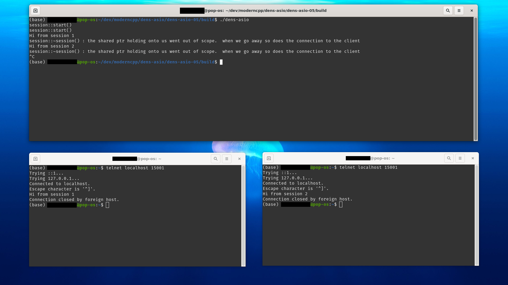

# Asynchronous I/O with C++: Lesson #5

[Original Code Source ](https://dens.website/tutorials/cpp-asio/async-tcp-server)

## Environment

OS: Pop!_OS 21.04

Compiler: Clang 12.0.0

Boost: 1.74

CMake: 3.18.4

## Topic: Asynchronous TCP

This simple server depends on boost.  I installed boost on linux using apt, and I did not have to tell cmake anything special (thank god!).

To build and run server
* mkdir build
* cd build
* cmake ../src
* make
* ./dens-asio

To test use a different terminal
* telnet localhost 15001
* type your message and press enter
* you will see message echoed by server
* your connection will be immediately closed

### Test: 1 Server with 2 Connections

